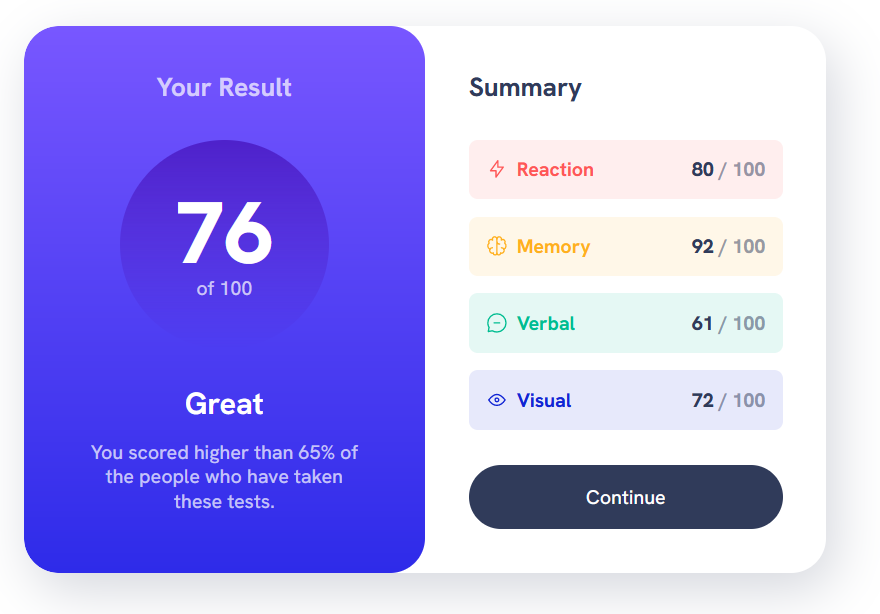

# Frontend Mentor - Results summary component

This is a solution to the
[Results summary component challenge on Frontend Mentor](https://www.frontendmentor.io/challenges/results-summary-component-CE_K6s0maV).
Frontend Mentor challenges help you improve your coding skills by building
realistic projects.

## Table of contents

- [Overview](#overview)
  - [Screenshot](#screenshot)
  - [Links](#links)
- [My process](#my-process)
  - [Built with](#built-with)
- [Author](#author)

## Overview

### Screenshot

### Links

- Solution URL:
  [Results summary component](https://tamertameen.github.io/Frontend-Mentor-Challenges/results-summary-component/)

## My process

### Built with

- Semantic HTML5 markup
- TailwindCSS

## Author

- Frontend Mentor -
  [@tamertameen](https://www.frontendmentor.io/profile/tamertameen)
